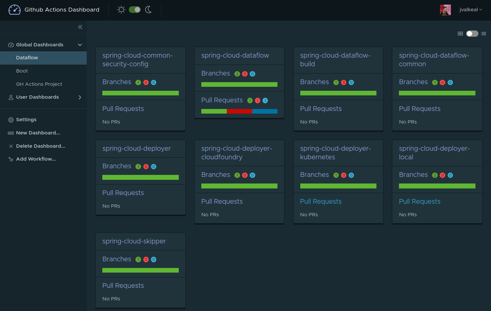

== Github Actions Dashboard

[NOTE]
====
This project is very much work-in-progress, it may work or not!
====

Custom dashboard application aggregating information from multiple
Github projects and their Actions.

Some notes about purpose and idea of this project:

- It's difficult to know a states of your actions if you have
  multiple projects, thus a need to get an aggregated view.
- Potentially we might want to do some calls against actions
  via Github api's what you currently can't do via Github's UI.

=== Building

Build:
[source, bash]
----
$ ./gradlew clean build
----

Build and skip all tests:
[source, bash]
----
$ ./gradlew clean build -x test
----

Run:
[source, bash]
----
$ java -jar github-actions-dashboard-server/build/libs/github-actions-dashboard-server-<version>.jar \
  --spring.security.oauth2.client.registration.github.client-id=<github client id> \
  --spring.security.oauth2.client.registration.github.client-secret=<github client secret>
----

Open: http://localhost:8080

If you have started to an instance with a demo profile:
[source, bash]
----
$ java -jar github-actions-dashboard-server/build/libs/github-actions-dashboard-server-<version>.jar \
  --spring.security.oauth2.client.registration.github.client-id=<github client id> \
  --spring.security.oauth2.client.registration.github.client-secret=<github client secret>
  --spring.profiles.active=demo
----
You may see thigs like:

=== Dev

When upgrading a bundled github graphql schema and as we rely on preview api, take it with:

[source, bash]
----
$ curl -H "Authorization: bearer <token>" -H "Accept: application/vnd.github.antiope-preview+json" https://api.github.com/graphql
----
